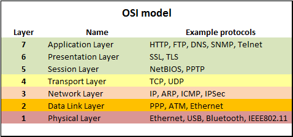

# Network

* [OSI 7 Layers](#osi-7-layers)

## OSI 7 Layers  

- 구성 요소: Physical - Data Link(MAC) - Network(IP) - Transport(TCP, UDP) - Session - Presentation(SSL, TLS) - Application(HTTP)
- HTTP/HTTPS
    - HTTP: 웹 상에서 클라이언트와 서버가 서로 정보를 주고받을 수 있도록 하는 프로토콜
    - HTTPS: Application 계층과 Transport 계층 사이에 있는 Presentation 계층에서 SSL 또는 TLS 인증서를 통해 보안을 강화한 HTTP 프로토콜
- TCP/UDP
    ||연결 지향|순서 보장|신뢰성|전송 속도|대상 애플리케이션|
    |:---:|:---:|:---:|:---:|:---:|:---:|
    |TCP|O|O|상대적으로 높음|상대적으로 느림|브라우저, 이메일, 파일 전송|
    |UDP|X|X|상대적으로 낮음|상대적으로 빠름|실시간 스트리밍, 온라인 게임|

[메인으로 가기](https://github.com/sekhyuni/computer-science) 
[맨 위로 가기](#network)